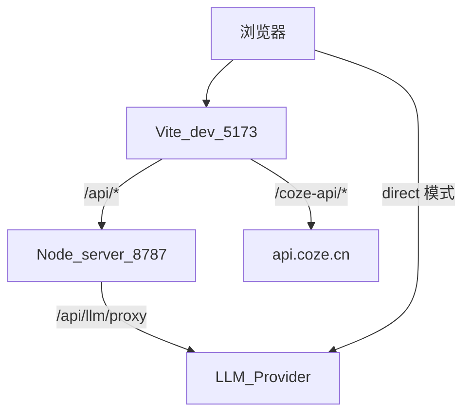
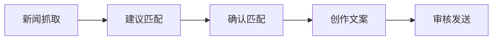

# 架构与目录

## 运行时结构



- **工作台**：Hash 路由 `#/`，五步流水线状态在 `WorkflowContext`。  
- **运营后台**：`#/admin/*`，读写 `AppConfig`（`AppConfigContext`）。  
- **配置三级**：`server` → `localStorage` → 代码内 `DEFAULT_APP_CONFIG`。

## 目录说明

```
trendwave/
├── docs/                     # 项目文档
├── server/
│   ├── index.mjs             # 配置 / LLM 中转 / RSS
│   └── data/
│       ├── .gitkeep
│       ├── config.example.json
│       └── config.json       # 本地运行时（gitignore）
├── src/
│   ├── admin/                # 运营后台 UI
│   ├── components/           # 工作台布局与步骤
│   ├── config/               # AppConfig 类型、默认值、合并与存取
│   ├── context/              # AppConfig / Integration / Workflow
│   ├── data/mock.ts          # 演示新闻与商品种子
│   ├── services/             # 扣子、LLM、提示词、质检、信源等
│   └── types/                # 工作流与集成类型
└── vite.config.ts            # /api、/coze-api 代理
```

## 核心数据流

### 工作台五步



- 抓取：[`newsSources`](../src/services/newsSources.ts) + [`newsGate`](../src/services/newsGate.ts)  
- 匹配：[`productMatch`](../src/services/productMatch.ts) → 建议页采纳 → 确认页终审/补选  
- 文案：见下节（不经扣子）

### 文案生成

1. 工作台选中新闻 + 商品 → `generateWeiboCopy`（[`src/services/copyGenerator.ts`](../src/services/copyGenerator.ts)）。  
2. 按 `AppConfig.model.mode`：`mock` / `direct` / `proxy`，用 [`promptEngine`](../src/services/promptEngine.ts) 渲染运营后台提示词后调 [`llmClient`](../src/services/llmClient.ts)。  
3. [`copyQA`](../src/services/copyQA.ts) 机审；失败时可 [`copyReview.autoReworkCopy`](../src/services/copyReview.ts) 返工。  
4. 扣子工作流**不参与**主路径；仅可在顶栏集成配置中做连通测试。

### 热点抓取

「立即抓取」→ [`fetchEnabledNews`](../src/services/newsSources.ts)（后台信源：内置演示 / RSS），不经扣子全流程灌入。

### 配置读写

[`src/config/store.ts`](../src/config/store.ts) `loadConfigTiered` / `saveConfigTiered`：

1. 尝试 `GET/PUT /api/config`  
2. 失败则读写 `localStorage`  
3. 再失败用 `DEFAULT_APP_CONFIG`

## 关键类型

| 类型 | 位置 | 用途 |
|------|------|------|
| `AppConfig` | `src/config/types.ts` | 提示词、模型、商品、信源、评测（工作台主控） |
| `IntegrationConfig` | `src/types/integration.ts` | 顶栏「集成配置」（密钥旁路、可选扣子连通测试） |
| `NewsItem` / `Product` / `CopyVariant` | `src/types/workflow.ts` | 流水线运行时实体 |
| `PipelineHydration` | `src/types/pipeline.ts` | 扣子解析结果（仅连通测试使用） |
